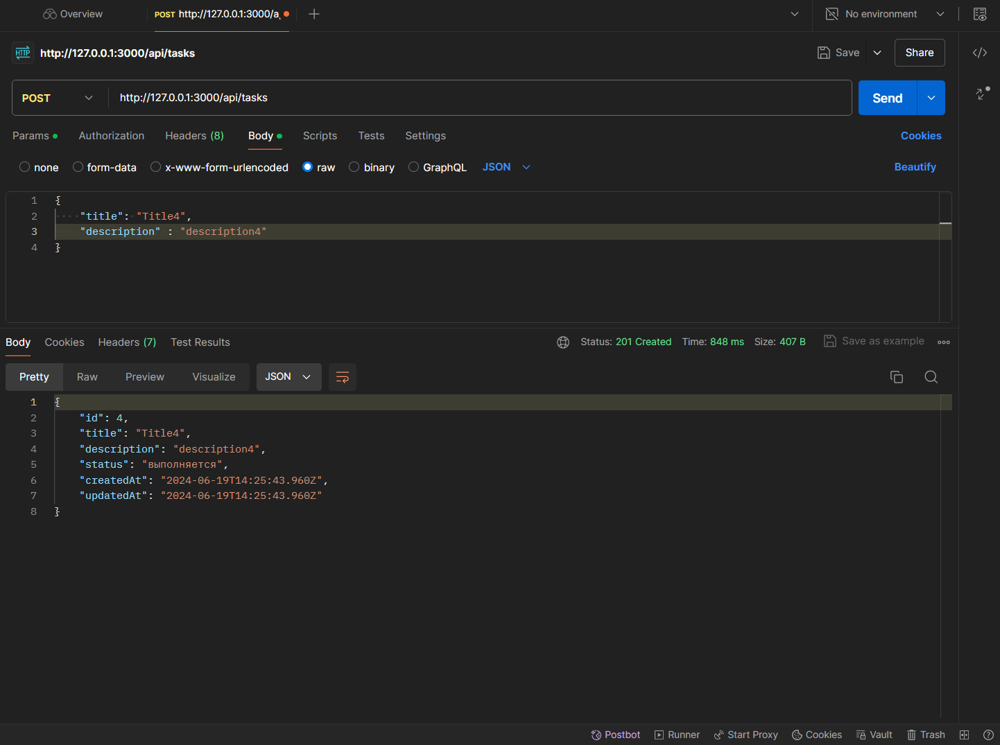
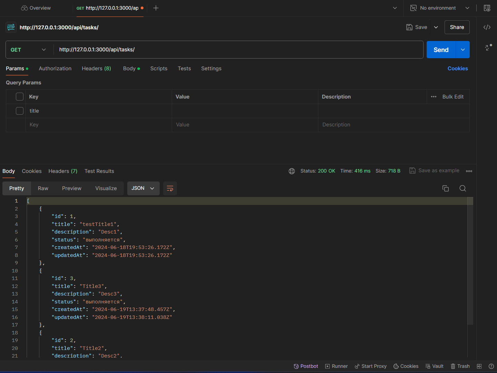
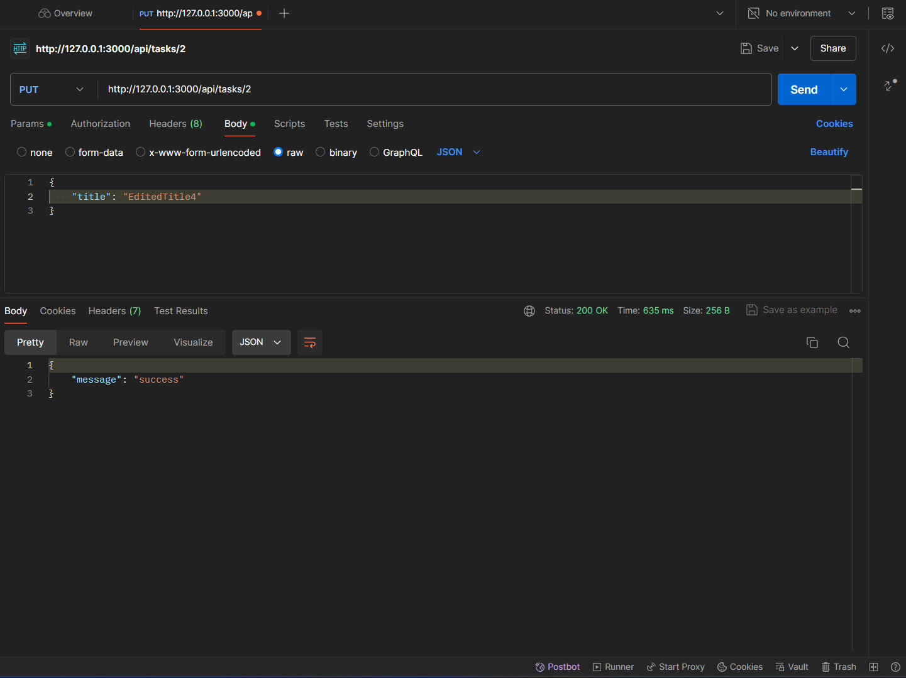
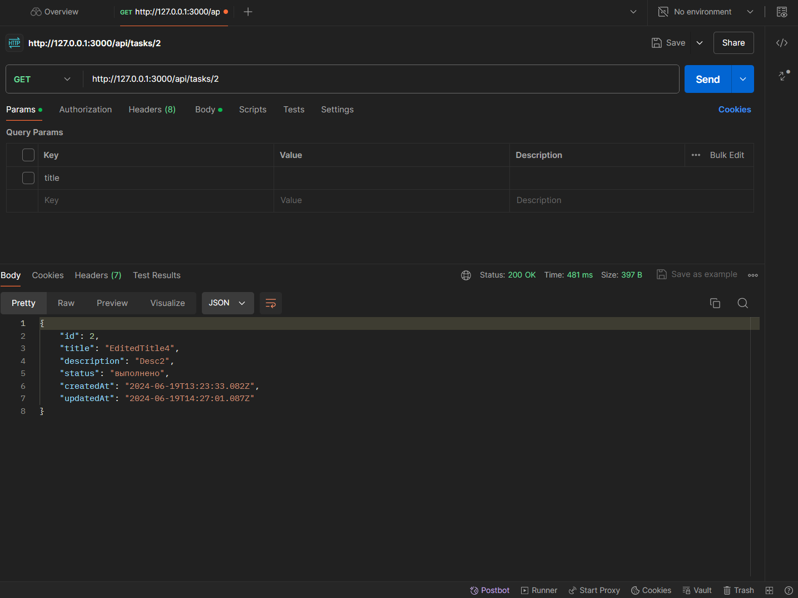
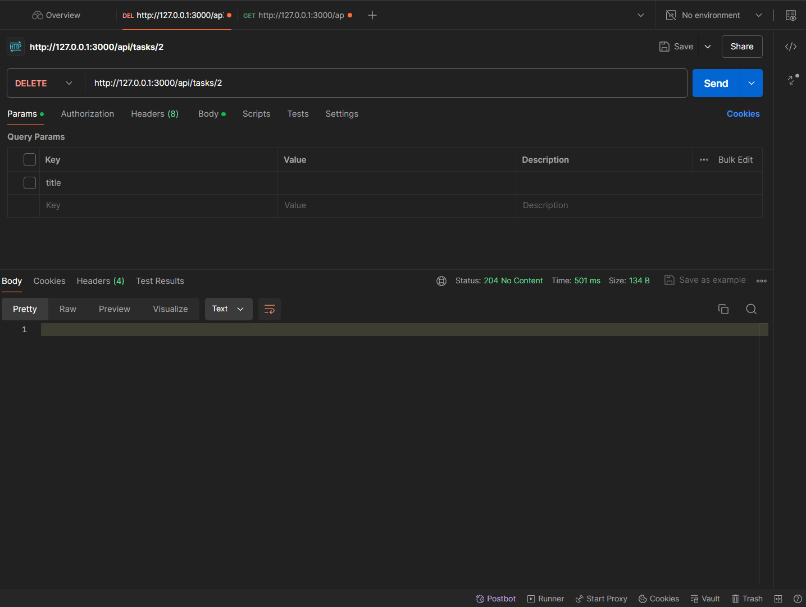
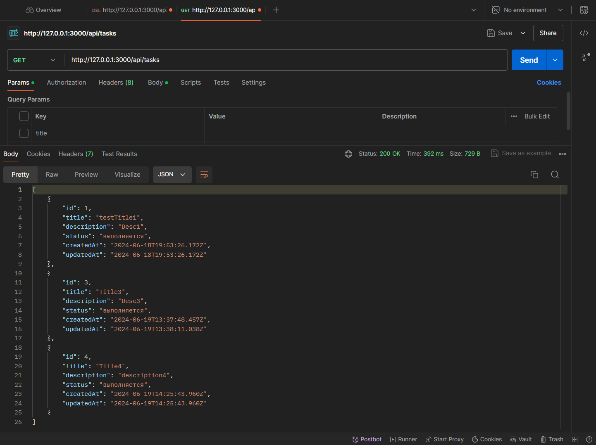

# CrafttechTestTask

## Описание

CrafttechTestTask - это веб-приложение для управления задачами, созданное с использованием Node.js, Express, TypeScript и PostgreSQL. Приложение позволяет пользователям создавать, редактировать, удалять и просматривать задачи.

## Установка

### Шаг 1: Клонирование репозитория

Клонируйте репозиторий на вашу локальную машину:

```
git clone https://github.com/yaaarslv/CrafttechTestTask.git
cd CrafttechTestTask
```

### Шаг 2: Установка зависимостей
Установите все необходимые зависимости:

```
npm install
```

### Шаг 3: Настройка переменных окружения
Создайте файл .env в корне проекта и добавьте туда настройки для подключения к вашей базе данных PostgreSQL:

```
DB_HOST=your_host
DB_PORT=5432
DB_USERNAME=your_username
DB_PASSWORD=your_password
DB_DATABASE=your_database
```

### Шаг 4: Запуск проекта
- Перейдите в каталог /src
```
cd src
```

- Для запуска приложения в режиме разработки используйте команду:
```
nodemon app.ts
```

- Для запуска приложения в стандартном режиме используйте команду:
```
ts-node app.ts
```

## API
Приложение предоставляет следующие API эндпоинты:

- POST /api/tasks - Создание новой задачи
- GET /api/tasks - Получение списка всех задач
- GET /api/tasks/:id - Получение задачи по ID
- PUT /api/tasks/:id - Обновление задачи по ID
- DELETE /api/tasks/:id - Удаление задачи по ID


## Примеры запросов
- ### Создание новой задачи


- ### Получение всех задач


- ### Получение задачи по идентификатору


- ### Обновлени задачи по id

#### Результат:


- ### Удаление задачи по id

#### Результат:
